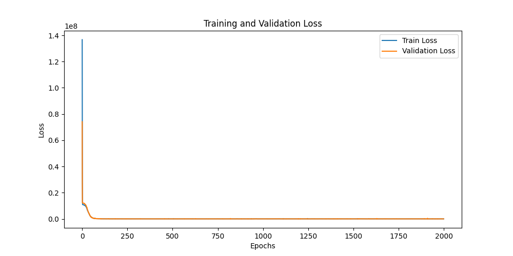
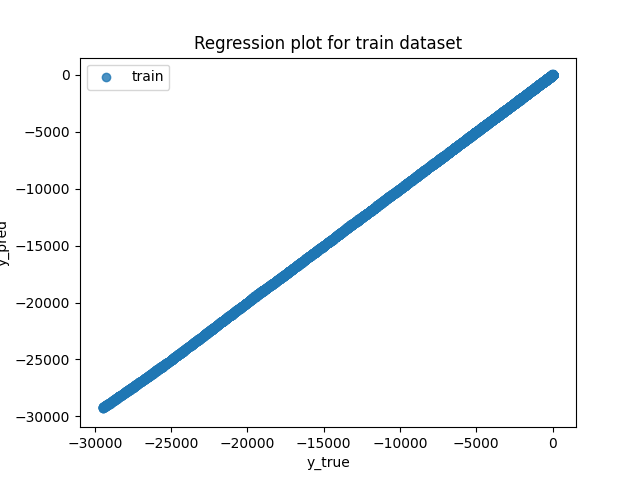
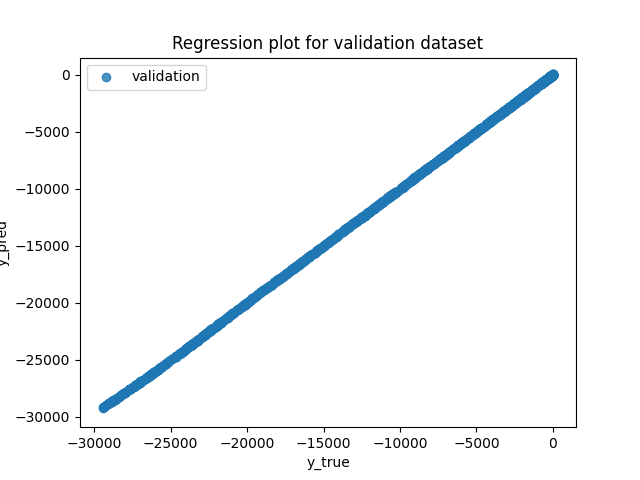
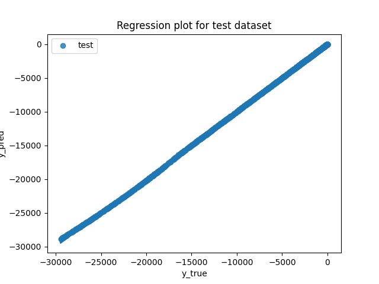
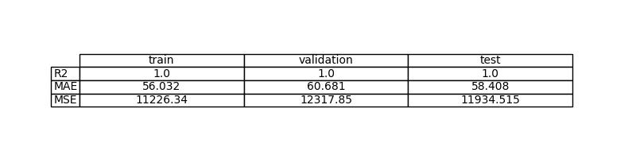
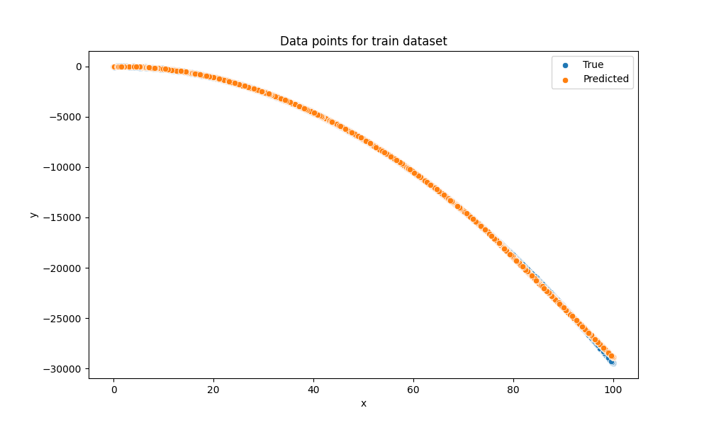
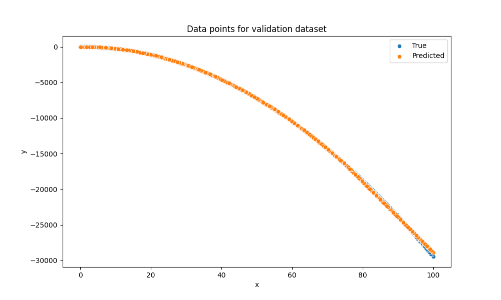
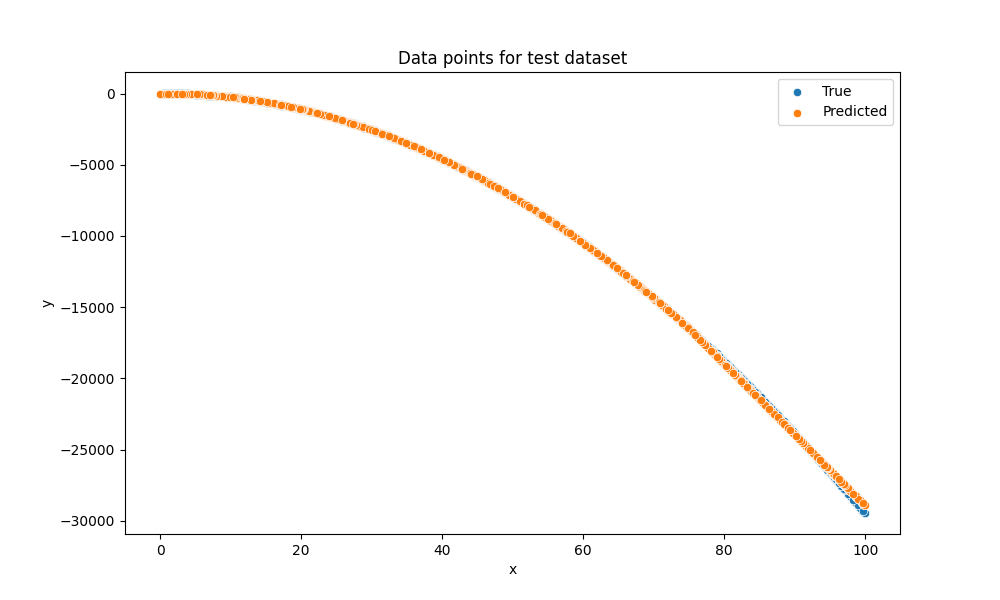

# Exercise 2: Learn a non-linear function with PyTorch, parable estimation

## Objective

Estimacion de una función desconocida con un modelo de red neuronal de aprendizaje. Este ejemplo en específico, el modelo trata de aproximar una función cuadrática con la siguiente forma: $y = -3x^2 + 5x + \epsilon$.

## Task Formalization

La tarea consiste en un problema de Aprendizaje Supervisado, concretamente una tarea de Regresión. A partir de una entrada continua $x$, el modelo debe predecir un valor de salida continuo $y$.

### Task Formalization (Inference)

Durante la inferencia, el modelo recibe un tensor $x$ y realiza un "forward pass" a través de tres capas lineales con activaciones no lineales para producir una estimación $\hat{y} = f(x; \theta)$.

### Task Formalization (Training)

El entrenamiento implica minimizar la diferencia entre la predicción $\hat{y}$ y el valor real $y$ del conjunto de datos. Esto se logra optimizando los pesos de la red $\theta$ mediante retropropagación y el algoritmo de optimización AdamW durante 1000 épocas.

## Evaluation metrics

Para medir el rendimiento de la regresión, se utilizan las siguientes métricas:

MSE (Error Cuadrático Medio): Mide el promedio de los errores al cuadrado.

MAE (Error Absoluto Medio): Mide el promedio de las diferencias absolutas entre la predicción y el valor real.

R² (Coeficiente de Determinación): Indica qué tan bien el modelo explica la variabilidad de los datos.

## Data Considerations

### Dataset description

El conjunto de datos es generado en dataset.py. Consta de 10000 muestras donde:
Entrada (x): Distribución uniforme entre 0 y 100.
Salida (y): Definida por el polinomio $-3x^2 + 5x$ más un ruido gaussiano $\delta$ con una desviación estándar de 20.

### Data preparation and preprocessing

Redimensionamiento: Los datos se transforman a la forma (-1, 1) para ser compatibles con las capas lineales de PyTorch.

Conversión de tipo: Los datos se convierten a torch.float32.

División: Los datos se dividen en 70% entrenamiento, 15% validación y 15% prueba.

### Data augmentation

No se realiza aumento de datos

## Model Considerations

Este modelo trata de un MLP (Multi Layer Perceptron)

### Suitable Loss Functions

Para tareas de regresión, son adecuadas funciones como el Error Cuadrático Medio (MSE), el Error Absoluto Medio (MAE)

### Selected Loss Function

La función seleccionada es MSE, que es el estándar en regresión ya que penaliza más fuertemente los errores grandes.

### Possible architectures

MLP Profundo: Múltiples capas ocultas con activaciones no lineales (Arquitectura seleccionada).

### Last layer activation

La última capa de activación seleccionada para este problema es el de la función Identity

### Other Considerations

El modelo utiliza LeakyReLU como función de activación en las capas ocultas, permitiendo un pequeño gradiente para los valores negativos.

## Training

El entrenamiento se realiza con el optimizador AdamW, una variante de Adam que integra mejor el decaimiento de pesos (weight decay).

### Training hyperparameters

Learning Rate: 0.001.

Batch Size: 128.

Épocas: 1000.

Optimizador: AdamW.

Capas ocultas: 2 capas de 256 neuronas cada una.

### Loss function graph

### Discussion of the training process

El proceso muestra una caída pronunciada de la pérdida en las primeras épocas, lo que indica que el modelo captura rápidamente la tendencia cuadrática. El uso de best_model.pth garantiza que conservamos los pesos con mejor rendimiento en validación, evitando fluctuaciones finales.

## Evaluation

### Evaluation metrics

El modelo logra un alto rendimiento en todos los conjuntos. Un R² cercano a 1.0 sugiere un ajuste excelente.

Metrics for each dataset is depicted: 

### Evaluation results

Here you have examples of evaluation results for train, validation and test sets.

Example for train set:

Example for validation set:

Example for test set:

### Discussion of the results

How the model solves the problem?
Lo que hicimos fue entrenar un MLP para aprender la relación x,y con ruido. Como la curva es no lineal, las ReLU ayudan a que la red siga bien esa forma.

Is there overfitting, underfitting or any other issues? 
No se ve overfitting: train y validation loss bajan casi juntas. Tampoco underfitting, porque las predicciones se pegan mucho a los valores reales en train/val/test.

How can we improve the model?
Parar antes (early stopping) porque la loss luego mejora muy poco, normalizar x para entrenar más estable, y ajustar neuronas/regularización solo si en otro dataset se empieza a separar train vs val.

How this model will generalize to new data?
Generaliza bien si los nuevos datos son parecidos (mismo rango y misma forma). En test se comporta similar a train/val, eso es buena señal.

## Design Feedback loops

Describe the process you have followed to improve the model and the evolution of performance of the model during the process.

Lo que hicimos fue: entrenar luego mirar curvas y plots luego ajustar (capacidad, epochs y/o escala) y volver a entrenar. La loss cae rápido al inicio y luego se estabiliza, indicando que el modelo aprende la tendencia principal temprano.

## Questions

Pleaser answer the following questions. Include graphs if necessary. Store the graphs in the `outs/exercise_02` folder.

### Which are the differences you found between previous model and this one?
Del ejercicio 1 al 2, pasamos de una base más simple a un modelo con más capacidad (MLP con ReLU) porque aquí la relación es más no lineal. Por eso el ajuste visual y las métricas salen mejores y consistentes.

### Does the model generalizes well to new data?
Sí, para datos similares. Train/val/test tienen resultados parecidos y las curvas de loss no se separan.

