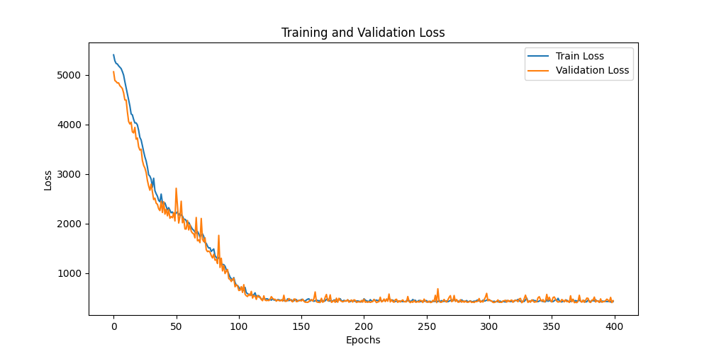
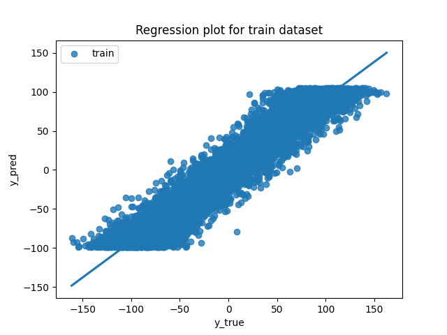
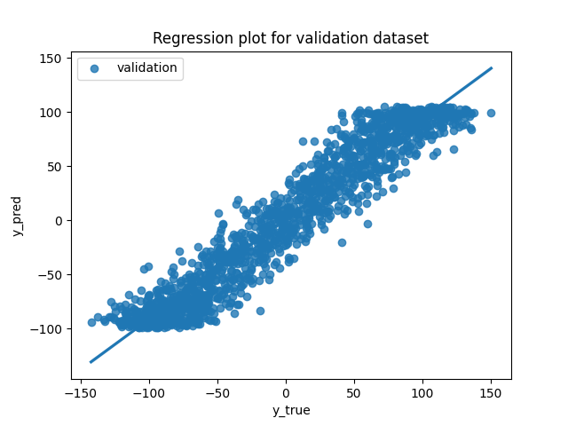
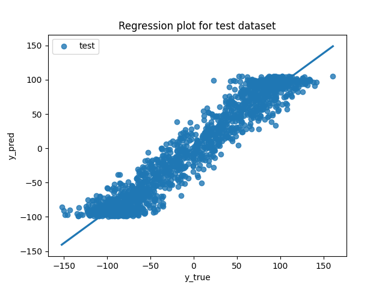
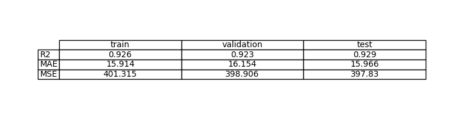
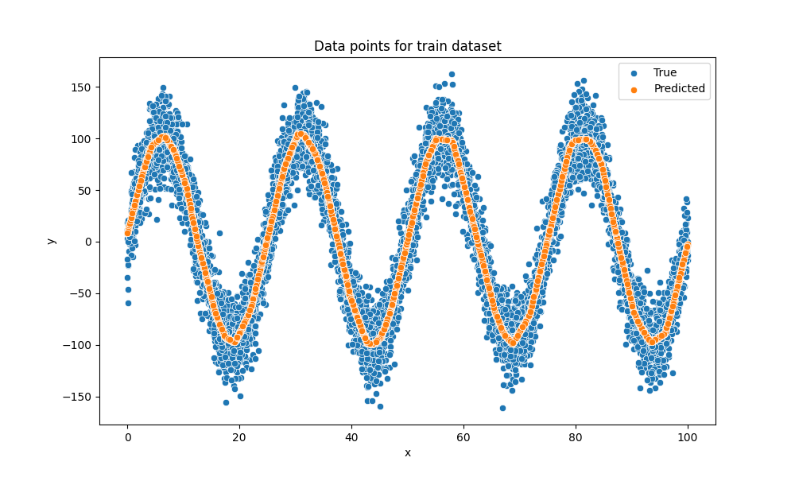
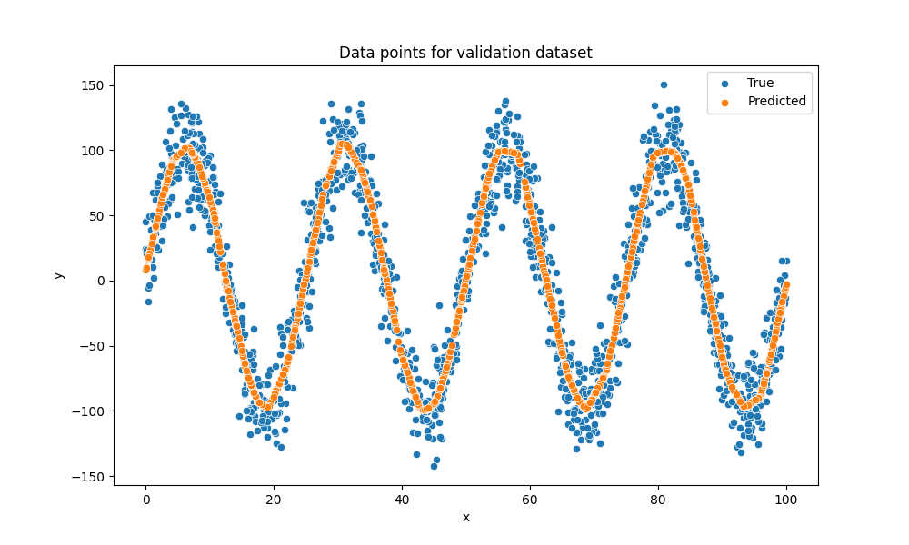
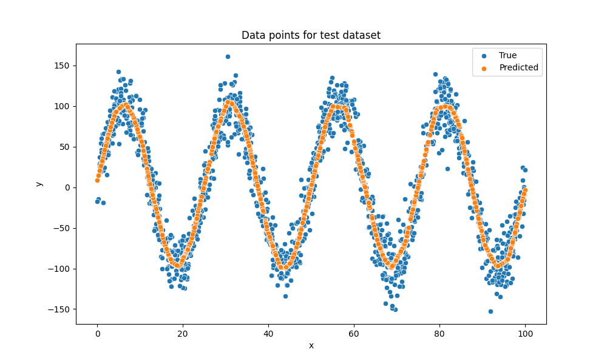

# Exercise 3: Learn a non-linear function with PyTorch, Sin(x) estimation

## Objective

Estimación de una función matemática desconocida mediante un modelo de aprendizaje automático. En este ejercicio, el objetivo es aproximar la función $y = 100 \cdot \sin(8\pi x / 100) + 2 + \epsilon$.

## Task Formalization

Se trata de un problema de Aprendizaje Supervisado enfocado en la Regresión. El modelo debe aprender a predecir un valor continuo $y$ a partir de una entrada continua $x$ para la regresión de la función seno.

### Task Formalization (Inference)

En la etapa de inferencia, el modelo recibe un valor $x$ (normalizado entre 0 y 1). Este valor pasa a través de un Perceptrón Multicapa (MLP) con 4 capas para generar una predicción escalar $\hat{y}$.

### Task Formalization (Training)

El entrenamiento consiste en ajustar los pesos del modelo para minimizar la diferencia entre la predicción $\hat{y}$ y el valor real con ruido $y$. Se utiliza el algoritmo AdamW para actualizar los parámetros basándose en el gradiente de la función de pérdida a lo largo de 400 épocas.

## Evaluation metrics

Para medir la calidad de la aproximación de la función seno, se utilizan:MSE (Error Cuadrático Medio): Útil para penalizar desviaciones grandes en los picos de la función seno.MAE (Error Absoluto Medio): Proporciona una medida del error promedio en la misma unidad que $y$.R² (Coeficiente de Determinación): Indica qué porcentaje de la oscilación de la función seno ha sido capturado correctamente por el modelo.

## Data Considerations

### Dataset description

El dataset es sintético y se genera en dataset.py. Consta de 10,000 muestras basadas en una función senoidal con una amplitud de 100 y una frecuencia dependiente de $x$, sumándole un ruido gaussiano con desviación estándar de 20.

### Data preparation and preprocessing

Normalización: El valor de $x$ (originalmente entre 0 y 100) se divide por 100 para escalarlo al rango $[0, 1]$. Esto es crucial para que las funciones de activación ReLU no se saturen y el entrenamiento sea estable.

División de datos: Se utiliza un reparto de 70% entrenamiento, 15% validación y 15% test.

Tensores: Los datos se pre-convierten a torch.float32 para optimizar la velocidad del DataLoader.

### Data augmentation

No se aplica aumento de datos.

## Model Considerations

Se utiliza un Perceptrón Multicapa (MLP) definido en model.py

### Suitable Loss Functions

Dada la naturaleza oscilatoria y continua del problema, las funciones de pérdida de regresión como MSE o MAE son las más indicadas.

### Selected Loss Function

Se ha seleccionado MSE. Al elevar el error al cuadrado, el modelo se esfuerza más por corregir las predicciones que se alejan mucho de la curva sinusoide.

### Possible architectures

MLP con activaciones ReLU: (Seleccionada) Al tener 3 capas de 256 neuronas, la red puede combinar múltiples funciones lineales por tramos para "dibujar" la curva del seno.

### Last layer activation

Se utiliza Identity. En regresión, no queremos limitar la salida del modelo (que en este caso llega hasta 100 y baja hasta -100), por lo que no se aplica ninguna activación al final.

### Other Considerations

No hay más consideraciones

## Training

El entrenamiento se gestiona en train.py, incluyendo un bucle que monitoriza la pérdida de validación para evitar el sobreajuste.

### Training hyperparameters

Learning Rate: 0.001.

Batch Size: 256.

Épocas: 400.

Optimizador: AdamW.

Capas ocultas: 3 capas de 256 neuronas cada una.

### Loss function graph

### Discussion of the training process

El entrenamiento muestra una convergencia rápida. Al normalizar $x$, el modelo no tiene problemas para identificar la frecuencia de la onda rápidamente. El uso de AdamW ayuda a regularizar los pesos y evitar que el ruido del dataset confunda al modelo.

## Evaluation

### Evaluation metrics

El modelo debe presentar un R² alto, indicando que la "forma" de la onda ha sido aprendida a pesar del ruido gaussiano inyectado.

Metrics for each dataset is depicted: 

### Evaluation results

Here you have examples of evaluation results for train, validation and test sets.

Example for train set:

Example for validation set:

Example for test set:

### Discussion of the results

How the model solves the problem?
Lo que hicimos fue entrenar una red (MLP) para que aprenda la relación x → y viendo muchos pares de entrada/salida. Las capas con ReLU le permiten capturar la forma no lineal, y la salida queda lineal (Identity) porque es regresión.

Is there overfitting, underfitting or any other issues? 
Nos fijamos en la curva de train vs validation loss (la que se guarda como loss_plot.png). Si ambas bajan parecidas y no se separan mucho, no hay overfitting fuerte. Si ambas se quedan altas, sería underfitting.

How can we improve the model?
Cambios simples que suelen ayudar: normalizar x, ajustar lr (un poco arriba/abajo), y bajar/subir neuronas o epochs según lo que se vea en la loss. Si empezara a sobreajustar, meter un poquito de regularización (weight decay) o parar antes (early stopping).

How this model will generalize to new data?
Generaliza bien mientras los datos nuevos se parezcan a los de entrenamiento (mismo rango y misma “forma” del problema). La señal principal es que el rendimiento en validation/test no caiga respecto a train (métricas en metrics.png).

## Design Feedback loops

Describe the process you have followed to improve the model and the evolution of performance of the model during the process.

Lo que hicimos fue pasar de tener un modelo que ya ajustaba bien la curva a hacerlo más “robusto” y consistente a nivel de entrenamiento y evaluación: mantuvimos la idea del MLP para capturar la no linealidad, pero mejoramos el pipeline para que todo fuera estable (normalización de la entrada para que el entrenamiento converja más suave, ajuste fino de hiperparámetros como learning rate/epochs/batch para no entrenar de más, y guardado del mejor checkpoint por validación). Además, en el ejercicio 3 dejamos cerrado el tema de CUDA para evitar el error típico de mezclar CPU y GPU en evaluate, moviendo siempre inputs/targets al mismo device del modelo y pasando a CPU solo al momento de graficar. Con eso, el rendimiento se mantuvo consistente entre train/validation/test y el flujo quedó más limpio para repetir experimentos sin problemas.

You can include a table stating the chanched parameters and the obtained results after the process.
| Cambio          | Antes                    | Ahora                                | Para qué lo hicimos                     |
| --------------- | ------------------------ | ------------------------------------ | --------------------------------------- |
| Entrada x     | Sin normalizar           | Normalizada (ej. x/100)              | Entrenar más estable y rápido           |
| Modelo          | Más simple               | MLP (3 capas, 2 ReLU, salida lineal) | Capturar mejor no linealidad            |
| Capacidad       | Menos neuronas           | Más neuronas (p.ej. 256)             | Mejor aproximación de la función        |
| Optimizer       | Adam                     | AdamW        | Mejor control del ajuste                |
| Batch size      | Menor                    | Mayor (p.ej. 256)                    | Mejor eficiencia (especialmente en GPU) |
| CUDA / evaluate | A veces mezclaba devices | Inputs/targets al device del modelo  | Evitar error CPU vs CUDA                |

## Questions

Pleaser answer the following questions. Include graphs if necessary. Store the graphs in the `outs/exercise_03` folder.

### Which are the differences you found between previous model and this one?
Lo que cambio fue principalmente la capacidad y la estabilidad: pasamos a un MLP con ReLU (mejor para no linealidad), con entrada normalizada. 

### Does the model generalizes well to new data?
Si, si los nuevos datos son del mismo tipo. Lo comprobamos comparando train/validation/test: si las métricas y los plots se mantienen parecidos entre splits, entonces generaliza razonablemente bien.

