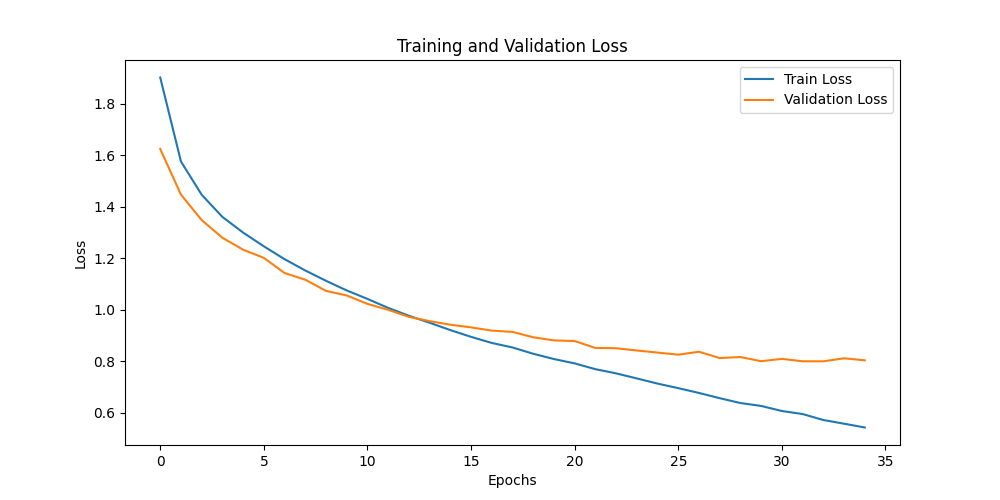
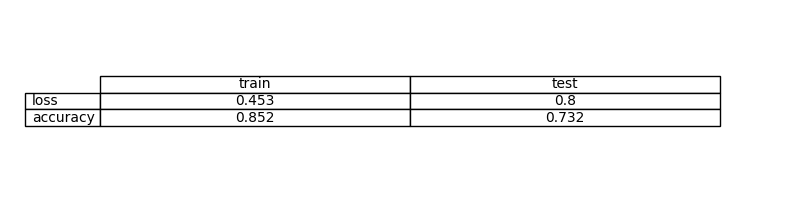
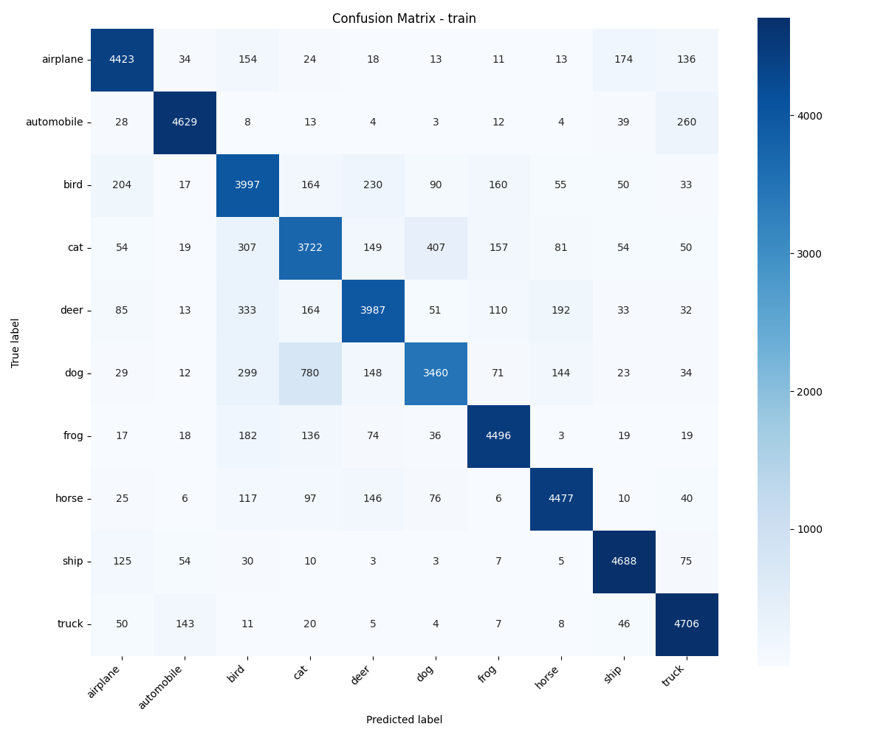

# Exercise 4: Create a Deep Learning Model for image classification in PyTorch with CIFAR-10 dataset

## Objective

Develop a model that can classify images from CIFAR-10 dataset

Then try a model with convolutional layers
Create an evaluate.py file that evaluates the model and calculates and stores the evaluation metrics including a confusion matrix

Compare this method with previous one (previous exercise)
Whats the effect of data augmentation?

Compare both methods and discuss the differences

## Task Formalization

Nuestra tarea sera una clasificacion multiclase: con una imagen RGB de 32x32, vamos predecir una de 10 clases.

### Task Formalization (Inference)

- In: tensor (3x32x32) ; Imagen RGB
- Out: vector 10 valores, un valor por clase

### Task Formalization (Training)

Como la tarea es de clasificacion entropia cruzada, lo que queremos es reducir el error entre la salida y la etiqueta real usando backprop y AdamW como optimizador.

## Evaluation metrics

- CrossEntropy Loss: Tarea de clasificacion
- Accuracy: Porcentaje de predicciones correctas.
- Confusion Matrix (train y test): Ver cuales etiquetas son las que predice mejor y cuales confunde con otras.

## Data Considerations

### Dataset description

CIFAR-10: 10 clases, imagenes RGB (32x32).

### Data preparation and preprocessing

- `ToTensor()`: convertimos la entrada a tensores para poder trabajar con pytorch. 

### Data augmentation

## Model Considerations

CNN con capas conv + pooling y luego capas fully connected con dropout para clasificar. Tratamos de implementar una version "reducida" de la arquitectura VGG16 vista en clase. 

### Suitable Loss Functions

- `CrossEntropyLoss` (multiclase) 

### Selected Loss Function

`nn.CrossEntropyLoss()`

### Possible architectures

- CNN simple (la usada)
- CNN mas profunda
- ResNet/VGG (normalmente mejor)

### Last layer activation

No tiene, porque la funcion de loss CrossEntropy lo maneja internamente.

### Other Considerations

Se uso dropout para reducir overfitting.

## Training

Entrenamiento supervisado con AdamW y mejor modelo por menor val loss.

### Training hyperparameters

- Optimizer: AdamW
- LR: 1e-4
- Batch size: 128
- Epochs: 35

### Loss function graph

### Discussion of the training process

Vemos que el train y el val loss bajan "juntos" pero al final se despegan un poco porque el val loss sube, esto indica un poco de overfitting. Cabe destacar que tratamos varios hiperparametros e incluso añadimos el dropout (apagar neuronas random, el mejor resultado fue con 0.4, osea apagando el 40% de las neuronas) porque teniamos mucho overfitting (el train loss bajaba mucho y el val loss subia mucho).

## Evaluation

### Evaluation metrics

Se calculo loss y accuracy en train y test, y se guardo la matriz de confusion.

### Evaluation results

Metricas finales:

- Train: loss ~ 0.453, accuracy ~ 0.852
- Test:  loss ~ 0.800, accuracy ~ 0.732

Matrices de confusion:

### Discussion of the results

How the model solves the problem?  
Este modelo como es CNN, aprende con filtros y obtiene diferentes caracteristicas depenediendo de cada filtro que generan las capas convolucionales y luego las capas fully connected nos dicen la clasificacion.

Is there overfitting, underfitting or any other issues?  
Hay un poco de overfitting porque podemos ver que el val loss empieza a subir al final, pero consideramos que es aceptable para nuestro caso.

How can we improve the model?  
Podriamos aplicar data augmentation (giros, cambios de colores, etc) para generar un dataset de train mas amplio, tambien podemos usar mas tecnicas de regularizacion a parte del droput y se pueden agregar mas capas convolucionales para obtener filtros mas especificos.

How this model will generalize to new data?  
El modelo generaliza bien dentro de lo que cabe, tiene un 73% de accuracy en el test pero puede mejorar.

## Design Feedback loops

1. Cambiamos la arquitectura a CNN en vez de MLP.
2. Bajamos un poco el learning rate para tener curvas mas suaves de aprendizaje y tener el mejor punto de perdida. 
3. Agregamos una capa de dropout porque teniamos mucho overfitting.

## Questions

### Which are the differences you found between previous model and this one?

Antes era MLP y esta red aprende de manera muy especifica y no puede detectar bien si hay cambios leves en la imagen. Ahora la CNN extrae features con filtros usando conv/pooling y por eso mejora la clasificacion y la generalizacion.

### Does the model generalizes well to new data?

Si, el test accuracy nos lo indica pero viendo el loss plot podemos mejorar y evitar ese pequeño overfitting del final. 

