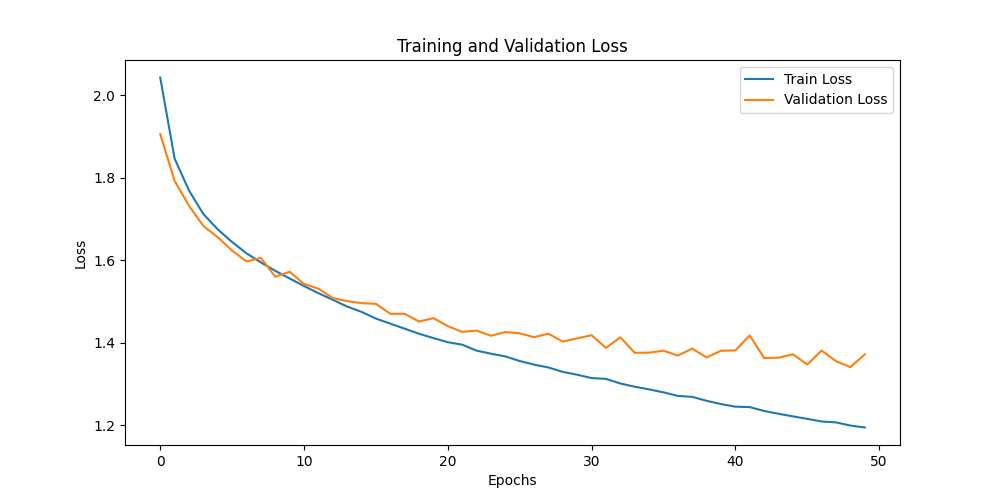
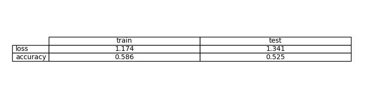
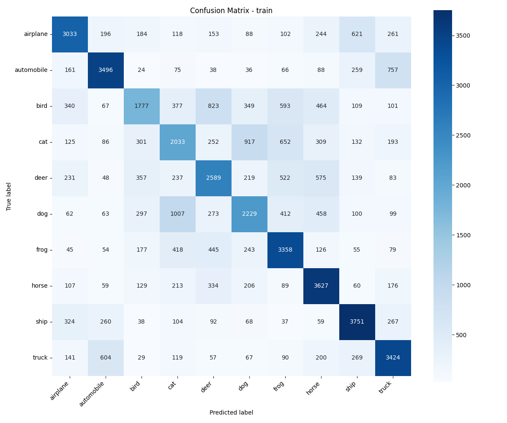
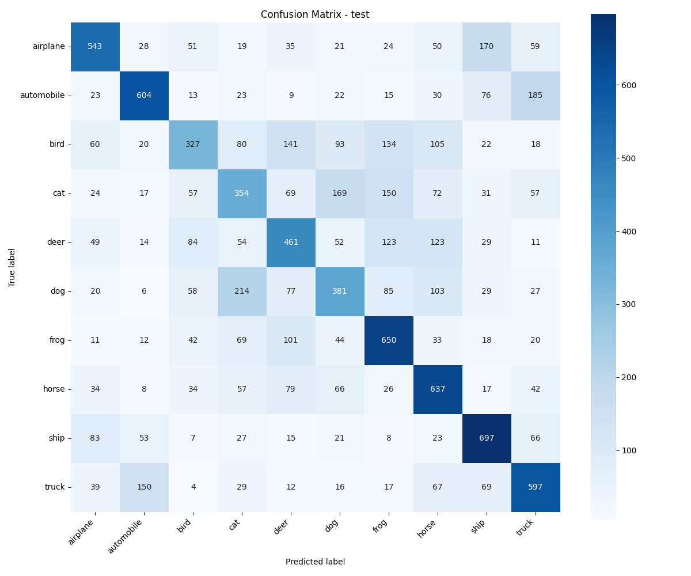

# Exercise 5: Create a Deep Learning Model for image classification in PyTorch with CIFAR-10 dataset

## Objective

Develop a model that can classify images from CIFAR-10 dataset

First try a model only with fully connected layers
Create an evaluate.py file that evaluates the model and calculates and stores the evaluation metrics including a confusion matrix

Which are the conclussions?

## Task Formalization

Nuestra tarea sera una clasificacion multiclase: con una imagen RGB de 32x32, vamos predecir una de 10 clases.

### Task Formalization (Inference)

- In: tensor (3x32x32) ; Imagen RGB
- Out: vector 10 valores, un valor por clase (logits)

### Task Formalization (Training)

Como la tarea es de clasificacion, queremos reducir el error entre la salida y la etiqueta real usando entropia cruzada (CrossEntropy), backprop y AdamW como optimizador.

## Evaluation metrics

- CrossEntropy Loss: loss para clasificacion
- Accuracy: porcentaje de predicciones correctas
- Confusion Matrix (train y test): ver que clases confunde mas

## Data Considerations

### Dataset description

CIFAR-10: 10 clases, imagenes RGB (32x32).

### Data preparation and preprocessing

- `ToTensor()`: pasamos a tensores para PyTorch

### Data augmentation

## Model Considerations

Modelo MLP (solo fully connected). Primero aplanamos la imagen (3072 features) y luego pasamos por varias capas lineales con ReLU.

### Suitable Loss Functions

- `CrossEntropyLoss` (multiclase)

### Selected Loss Function

nn.CrossEntropyLoss()

### Possible architectures

- Perceptron simple (baseline)
- MLP con mas capas / mas neuronas (la usada)
- CNN/ResNet 

### Last layer activation

No tiene, porque CrossEntropy trabaja con logits directamente.

### Other Considerations

MLP pierde la estructura espacial de la imagen al hacer flatten, por eso normalmente rinde peor que una CNN en vision.

## Training

Entrenamiento supervisado con AdamW y mejor modelo por menor val loss.

### Training hyperparameters

- Optimizer: AdamW
- LR: 1e-4
- Batch size: 128
- Epochs: 50

### Loss function graph

### Discussion of the training process

Vemos que train y val loss bajan, pero se quedan relativamente altos y bastante cerca. Esto sugiere mas bien underfitting o limitacion del modelo (no logra aprender bien patrones de imagen). Al final hay un pequeno gap (indicios de overfitting).

## Evaluation

### Evaluation metrics

Se calculo loss y accuracy en train y test, y se guardo la matriz de confusion.

### Evaluation results

Metricas finales:

- Train: loss ~ 1.174, accuracy ~ 0.586
- Test:  loss ~ 1.341, accuracy ~ 0.525

Matrices de confusion:

### Discussion of the results

How the model solves the problem?  
El MLP aplana la imagen y aprende combinaciones de pixeles, pero al no usar convoluciones (no filtros) no captura bien bordes/texturas locales, por eso le cuesta mas.

Is there overfitting, underfitting or any other issues?  
Podria ser que underfitting: el accuracy en train no sube mucho y el loss se queda "alto" con respecto a CNN, y train/val estan bastante cercanos.

How can we improve the model?  
Aumentar capacidad (mas neuronas), usar regularizacion mejor o cambiar a CNN. Tambien data augmentation puede ayudar.

How this model will generalize to new data?  
Generaliza mas o menos con un test accuracy ~52%, pero no es tan bueno para imagenes comparado con una CNN.

## Design Feedback loops

1. Probamos MLP con varias capas (4 FC) y ReLU.
2. Ajustamos learning rate a 1e-4 con AdamW para mas estabilidad.
3. Corremos mas epochs (50) para ver si mejora, pero se nota la limitacion del MLP.

## Questions

### Which are the differences you found between previous model and this one?

El ejercicio anterior con CNN aprovecha los filtros y aprende mejores features. Este con MLP hace flatten y pierde esa informacion, por eso baja bastante el rendimiento (aqui 0.52 test vs CNN 0.73 test).

### Does the model generalizes well to new data?

No tan bien. Se ve por el test accuracy (0.52) y por la matriz de confusion que hay muchas clases que se mezclan. Para generalizar mejor conviene CNN.